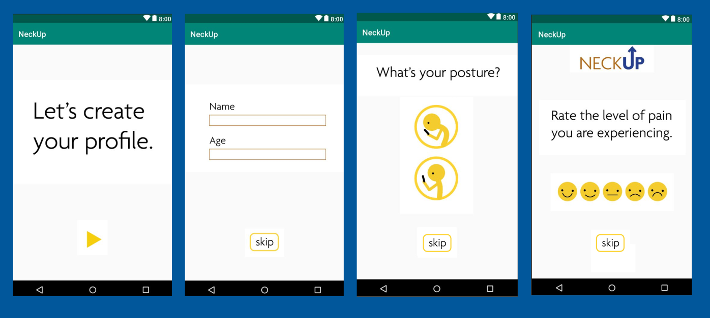

# NeckUp
An Android app that trains people to correctly hold their phones to relieve neck pain

## Getting Started
## Introduction

NeckUp was founded during [Philly Startup Weekend 2018](http://communities.techstars.com/usa/phlsw/startup-weekend). It is an interactive and non-invasive tool helping users develop muscle memory for correct posture while they go about their regular routines. 

To do this, NeckUp app runs in the back in the background on the users' phone, dimming the screen whenever they hold the phone in bad posture, reminding them to hold the phone upright to reduce neck pain.

*Illustration of the app purpose:*


The instructions below will get you a copy of the project on your local machine for development and testing purposes.

### Prerequisites
- Java Developemnt Kit
- Android Studio
- An Android Phone, or Emulator for testing purposes
  
### Installing
First, clone the repository to your local machine
```
$ git clone https://github.com/ngojason9/Neck-Up/
```
Open the project using `Android Studio` and hit `build app`. 

Here are the screenshots for the app:


## Acknowledgements
I first want to thank Haverford Innovation Program for the funding to attend this event.

Second, I would like to thank my wonderful teammates during Philly Startup Weekend: Jackie, Dan, Bruce, Nikita, Becca, and Mo Bing. The app could not have been finished without you guys.


If you have any questions, please contact me at <ngojason9@gmail.com>.